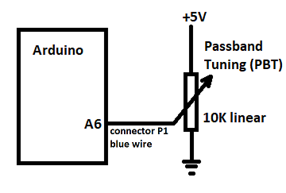
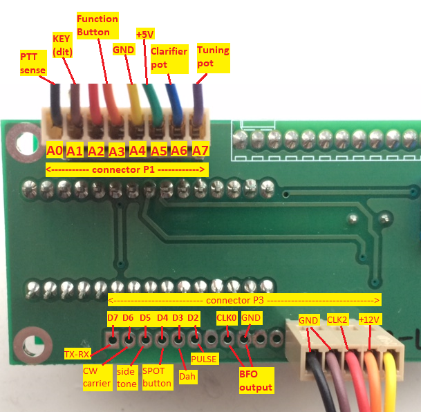

## User instructions for Raduino_v2.04

First time builders: It is recommmended to first install the [raduino v1](https://github.com/amunters/bitx40) sketch and make sure that everything including the related mods work properly, before proceding with this v2 sketch.

**IMPORTANT**: This sketch version requires the library ["PinChangeInterrupt"](https://playground.arduino.cc/Main/PinChangeInterrupt) for interrupt handling. Use your IDE to install
it before compiling this sketch.

**NOTE**: This v2 sketch only works if the following modifications are installed:
- [the digital BFO mod](#digital-bfo-mod)
- [the Function Button](#function-button)
- [the PTT sense mod](#ptt-sense-wiring)

After a version update all user settings, calibration data, etc will be reset to 'factory' values.
Depending on the user's choice, additional functionality provided by this software can be activated by installing the related (minimal) hardware mods. See the table below showing which mods are required for each function. Details of each mod are described below.

## Digital BFO mod

- remove C91 and C92 (prevent attenuation of the VFO signal)
- remove (or 'thombstone') R101 (disable the original analog crystal BFO oscillator)
- install a short shielded cable from the Raduino si5351 CLK0 output to pin 6 of T4 on the BitX40 main board

As the BFO signal is now generated by the si5351, the received audio may initially sound unnatural (pitched too low or too high). Perform the calibration procedures to precisely calibrate the VFO and BFO frequency.

## PASSBAND TUNING

Optionally install a 10K or 100K linear potentiometer on the front panel and connect the slider to pin A6 (connector P1, blue wire). Tip: If you also install the [10-turn tuning pot](#10-turn-tuning-pot), then you can re-use the original 1-turn pot for the PBT control.
Turning this pot will shift the BFO frequency in RX mode, which acts as a Passband Tuning (PBT) control. Although the principle is different, the behaviour is somewhat similar to 'IF-shift' as seen on many commercial rigs.
Passband Tuning is disabled by default, go to the SETTINGS menu to [enable this function](#pbt-enable).
Note: Do not enable PBT when the PBT pot is not installed, as this will lead to random readings from the Arduino's analog input!

## FUNCTION BUTTON WIRING:

Connect a momentary pushbutton between pin A3 (connector P1, orange wire) and ground.
Arduino's internal pull-up resistors are used, therefore do NOT install an external pull-up resistor!

## PTT SENSE WIRING:

Connect pin A0 (connector P1, black wire) via a 10K resistor to the output of U3 (LM7805 regulator) on the BITX40 board.

When the PTT is not pressed (RX mode), the regulator will be off, so pin A0 will see 0V (LOW).
When the PTT is pressed (TX mode), the regulator will be on, so pin A0 will see +5V (HIGH).
The PTT SENSE line 'tells' the Arduino whether we are in RX or TX mode.

## PIN LAYOUT

### Connector P1 (8 pin)

* input A0 (black): PTTSense
* input A1 (brown): KEY (straight key) or "dit" (paddle)
* A2 (red): not currently used
* input A3 (orange): Function Button
* GND (yellow)
* +5V (green)
* input A6 (blue): PBT pot
* input A7 (purple): Tuning Pot

### Connector P3 (16 pin)

The first 11 pins have no headers (pads only):

* output D7: TX-RX
* output D6: CW Carrier
* output D5: CW Side Tone
* input D4: CW SPOT Button
* input D3: "dah" (paddle)
* output D2: PULSE for capacitive touch keyer
* output CLK0, BFO signal
* GND

The 5 pin header

* GND (black)
* GND (brown)
* CLK2 (red)
* +12V (orange)
* not used (yellow)

## 10-TURN TUNING POT

The default frequency span of the standard supplied 1-turn tuning pot is only 50 kHz.
If you install a 10-turn pot instead you can extend the span for full 40m band coverage.
Tip: Save the original one-turn pot and re-use it for the [Passband Tuning](#passband-tuning) control.

Using the Function Button, go to the SETTINGS menu and [set the desired pot span](#tuning-range).

## CONNECTING A STRAIGHT MORSE KEY or 'TUNE' BUTTON:

A straight key (or external electronic keyer) can be connected to Raduino pin A1 (connector P1, brown wire).
It is recommended to install a 1K series resistor to protect the Arduino input. When the key is up (open) pin A1 will be HIGH.
When the key is down (closed, shorted to ground) pin A1 will be LOW, and a carrier will be transmitted.

You could also wire up a simple push button instead of connecting a morse key. The generated CW carrier can be used for
tuning up your antenna. In that case please note that you will be transmitting a carrier at full duty cycle, therefore don't
keep the tune button pressed for too long to prevent overheating the final!

## AUTOMATIC KEYER - CONNECTING A PADDLE:

The Raduino is set up for straight key operation by default. If you want to use the automatic keyer, go to the SETTINGS menu
and to 'CW parameters' => 'Key-type' and select 'paddle', 'rev. paddle' (for left-handed operators), 'bug', or 'rev. bug'.
Connect the 'dit' contact to Raduino pin A1 (connector P1, brown wire).
Connect the 'dah' contact to Raduino pin D3 (connector P3).
It is recommended to install 1K series resistors to protect the Arduino inputs.
The built-in keyer provides Iambic mode A and 'bug'-mode (Vibroplex emulation) functionality and the paddles can be reversed.

## CW KEYER SPEED CONTROL:

The speed can be controlled from the front panel (range 1-50 WPM). While keying, press and release the FB to increase the speed, or the SPOT button to reduce the speed. The CW speed setting is memorized in EEPROM.

## CAPACITIVE TOUCH KEYER:

The sketch supports Capacitive Touch functionality. With this feature it is possible to use touch sensors instead of a
mechanical morse key or paddle. Manual straight key as well as automatic keyer operation is possible via the touch sensors.
See the following demo: https://www.youtube.com/watch?v=9MWM6UVy9k4

A minimal modification (add four resistors) is required for this function.
Note: some builders reported that the touch sensor wasn't reliably detected during power on, in that case add some small (3-22pF) capacitors to both inputs in order to slightly increase the internal 'base' capacitance.

The capacitive touch sensors are disabled by default. To enable them, go to the SETTINGS menu and to 'CW parameters' =>
'Touch sensor', and use the tuning knob to set the desired touch sensor sensitivity.

A good sensitivity value to start with is 22. Increase the value for more sensitivity. The maximum value is 25.
The sensitivity setting is quite delicate and depends on your personal taste. The best results are usually obtained with
high sensitivity. However, if the sensitivity is too high, the radio may be keyed by electrical noise or objects nearby
the touch pads. It may also happen that iambic keying will occur even when only one touch pad is touched. Reduce the
sensitivity if these symptons occur. On the other hand, if the sensitivity is too low, the keyer may not respond properly
to the touch pads, for example double DITs or DAHs may be generated. Some experimentation may be required to find the optimum
setting.

The touch sensors are calibrated automatically at start up. If you want to recalibrate them, simply power OFF and ON again,
while NOT touching the sensor pads. The sensor calibration data will be shown on the LCD display at start up.
Note: When the touch keyer is enabled, normal paddle operation is not possible. If you want to use a standard paddle, disable the touch sensors by setting the sensitivity to 0 (touch sensor OFF).

If the touch sensors are not detected at power up, the internal base capacitance may be just too low. In that case, adding small capacitors (1-10 pF) from A1 to ground and from D3 to ground may help.

## CW-CARRIER WIRING:

This is required for CW operation (or when you want to generate a carrier for tuning)
Connect a wire from Raduino ouput D6 (connector P3, pin 15), via a 4.7K series resistor, to the input of the mixer.

When the key is down ouput D6 will be HIGH. This injects some DC current into the mixer so that it becomes unbalanced.
As a result a CW carrier will be generated.

Note: If the carrier is not generated at full output power, you may need to reduce the 4.7K series resistor to a lower value
for more drive. However try to keep it as high as possible to keep a clean CW signal. Never use a resistor less than 1K!
Extra tip: For tuning purposes a reduced carrier is usually desired. You can optionally connect a 100K pot in series with the
4.7K resistor, this will allow you to reduce the strength of the carrier to a suitable level.

The CW-CARRIER is only required for CW functionality. If you don't install this line everything else
will still work normally.

## CW SIDE TONE WIRING:

A side tone is available at Raduino output D5 (connector P3, pin 14). This signal can be fed to the speaker/headphones
in parallel to the output from the existing audio amplifier.

The desired side tone pitch can be set using the Function Button in the SETTINGS menu.
The CW-side tone is only used for CW operation. If you don't install this line everything else
will still work normally.

## TX-RX WIRING:

This is required for CW operation.

When the key is down output D7 (connector P3, pin 15) will be HIGH. It will only go LOW again when the key has been up for at
least 350 ms (this timeout value can be changed via the SETTINGS menu).
This signal is used to drive an NPN transistor which is connected in parallel to the existing PTT switch, so that it will
bypass the PTT switch during CW operation. As as result the relays will be activated as long as D7 is HIGH.
(Suggestion: If you have a combined microphone/PTT connector, the PTT bypass transistor can be soldered directly on the
back of it).

## CW SPOT/FINE TUNE Button:

Connect a momentary pushbutton between pin D4 (connector P3) and ground.
Arduino's internal pull-up resistors are used, therefore do NOT install an external pull-up resistor!
When operating CW it is important that both stations transmit their carriers on the same frequency.
When the SPOT button is pressed while the radio is in RX mode, the RIT will be turned off and the sidetone will be generated
(but no carrier will be transmitted).

While the SPOT button is held pressed, the radio will temporarily go into "FINE TUNE" mode, allowing the VFO to be set at 1Hz 
precision. This feature works also in SSB mode (except that no sidetone will be generated then).
Tune the tuning pot so that the pitch of the received CW signal is equal to the pitch of the CW Spot tone.
By aligning the CW Spot tone to match the pitch of an incoming station's signal, you will cause your signal and
the other station's signal to be exactly on the same frequency (zero beat).
(The SPOT button is just an extra tuning aid and is not strictly required for CW - if you don't install it, CW operation is
still possible).

## DIAL LOCK FUNCTION

Press the Function Button and then the SPOT button simultanuously to lock the dial.
When the dial is locked tuning will be disabled, PTT and CW is still possible.
Press the Function Button again to unlock.

## SPURIOUS BURST PREVENTION

In order to prevent that a spurious burst is emitted when switching from RX to TX, a short delay (TX_DELAY) is applied.
By default the TX_DELAY is set to 65 ms. The delay time can be adjusted by editing line 71 as necessary.

## FUNCTION BUTTON USAGE:

Several functions are available with just one pushbutton.
Certain menu options will not appear when the related hardware mods are not installed.

### Operating Mode

In normal operation mode:

* 1 short press - toggle VFO A/B
* 2 short presses - RIT on (PTT sense is required for this function) (press FB again to switch RIT off)
* 3 short presses - toggle SPLIT on/off (PTT sense is required for this function)
* 4 short presses - switch mode (rotate through LSB-USB-CWL-CWU)
* 5 short presses - start frequency SCAN mode
* 6 short presses - start VFO A/B monitoring mode
* long press (> 1 second) - VFO A=B

### Settings Mode

To enter SETTINGS menu, press and hold the Function Button for a VERY long (>3 seconds).
 
#### Frequency Scan

1 short press sets frequency SCAN parameters (lower limit, upper limit, step size, step delay)

 - using the tuning pot, set the desired lower frequency scan limit
 - press the FB
 - using the tuning pot, set the desired upper frequency scan limit
 - press the FB
 - using the tuning pot, set the desired scan step size
 - press the FB
 - using the tuning pot, set the desired scan step delay (also used for A/B monitoring mode)
 - press the FB again to save the settings

#### CW Configuration

2 short presses - set CW paramaters (sidetone pitch, CW-key type, semiQSK on/off, QSK delay)
   (only available when PTTsense line is installed)

 - using the tuning pot, select "straight" for straight CW key operation, "paddle" for automatic CW keyer,
   "rev. paddle" for left-handed CW-operators, "bug", or "rev. bug".
 - press the FB
 - using the tuning pot, select Auto-space ON or OFF (only when automatic CW keyer was selected)
 - press the FB
 - using the tuning pot, set the desired touch keyer sensitivity (0=OFF) (only when touch sensor mod is installed)
 - press the FB
 - using the tuning pot, select semiQSK ON or OFF (only when TX-RX mod is installed)
 - press the FB
 - using the tuning pot, set the desired timeout value (ms) (only when semiQSK in ON)
 - press the FB again to save the settings
 - using the tuning pot, set the desired sidetone pitch
 - press the FB

#### VFO & BFO Calibration

3 short presses - VFO/BFO frequency calibration

In calibration mode, the vfo will be temporarily set to the low side of the IF, it will be set back to the original setting when the calibration procedure has been completed.
Also while in calibration mode, the CW RX offset is temporarily disabled and Semi-QSK is turned off. To transmit a CW signal will require closure of the PTT switch to go into transmit and then CW key down to generate a carrier.

- Use another transceiver to generate a CW carrier at a known frequency (for example exactly 7100.000 kHz) (or ask a friend to transmit a carrier at a known frequency)
- First set the VFO to exactly 7100.000 kHz in LSB mode (the received signal may not yet be zero beat at this point)
- Press the Function Button
- Using the tuning pot, adjust the correction value (ppm) for exactly zero beat (i.e. turn the tuning knob on the Bitx40 so that the frequency of the received audio tone decreases down to 0 Hz, then stop)
- Press the Function Button again to save the setting
- Ask your friend to transmit an LSB signal without changing the frequency
- Using the tuning pot, adjust the BFO frequency for a natural sound in LSB mode
- Connect a  wattmeter (in its lowest power setting) and a dummy load  to the Bitx40. 
- Close the PTT button and fine-tune the BFO setting for zero watts out, with no audio input to the microphone. This ensures that BFO is set properly to suppress the carrier. 
- Press the Function Button again to save the setting
- The radio will now switch to CWL mode. 
- With the dummy load and wattmeter still connected to the rig, close both the PTT button and CW key and adjust the BFO frequency for full power out as measured on the low power setting on the wattmeter.
- Close just the PTT button and fine-tune the BFO setting for minimal carrier power (it should be possible to achieve < 10 mW of carrier on PTT closure, while still maintaining very close to full power output with both PTT and CW Key closed). 
- Press the Function Button again to save the setting
- The radio will now switch to USB mode.
- Ask your friend to transmit a USB signal without changing the frequency
- Using the tuning pot, adjust the BFO frequency for a natural sound in USB mode
- Using a dummy load and wattmeter in its lowest power setting connected to the Bitx40, close the PTT button and fine-tune the BFO setting for zero watts out, with no audio input to the microphone. This ensures that the BFO is set properly to suppress the carrier. 
- Press the Function Button again to save the setting
- The radio will now switch to CWU mode. 
- With a dummy load and wattmeter connected to the rig, close the PTT button and CW key and adjust for full power out as measured on the low power setting on the wattmeter. 
- Close just the PTT button and fine-tune the BFO setting for minimal carrier power (it should be possible to achieve < 10 mW of carrier on PTT closure, while still maintaining very close to full power output with both PTT and CW Key closed). 
- Press the Function Button again to save the setting

#### VFO Low/High

4 short presses - VFO Low/High

#### Tuning Range

5 short presses - set tuning range (min frequency, max frequency, pot span)

  - using the tuning pot, set the minimum tuning frequency and press the FB
  - using the tuning pot, set the maximum tuning frequency and press the FB again
  The default pot span is 50 kHz, this is OK for a standard 1-turn pot
  If you install a multi-turn pot instead you can extend the pot span
  - using the tuning pot, set the desired pot span
    recommended value: 50 kHz for a 1-turn pot, 200 kHz for a 10-turn pot
    (if the radio is mainly used for CW: a pot span of 10-25 kHz is recommended)
  - press the FB again to save the setting
  
#### PBT ENABLE

6 short presses - Disabled (OFF) by default. If the PBT pot is installed, enable this function by setting this to ON.

#### Exit Settings
 
One long press (>1 second) will exit the SETTINGs menu and return to normal [operating mode](#operating-mode)

All user settings are stored in EEPROM and retrieved during startup.

### Factory Settings

To reset all user settings to "factory" values, press and hold the Function button during power on. The factory settings are:

* VFO calibration value: 180 ppm
* VFO setting: high side
* BFO in LSB mode: 11998800 Hz
* BFO in USB mode: 11996600 Hz
* Pass Band Tuning: disabled
* Minimum frequency: 7000 kHz
* Maximum frequency: 7300 kHz
* Tuning pot span: 50 kHz
* Mode LSB for both VFO A and B
* CW side tone: 800 Hz
* CW key-type: Straight key
* CW keyer speed: 16 WPM
* Touch sensors: OFF
* Auto-space: OFF
* semiQSK: ON
* QSK delay: 350 ms
* Lower scan limit: 7100 kHz
* Upper scan limit: 7150 kHz
* Scan step: 1 kHz
* Scan step delay: 500 ms

A warning message "VFO uncalibrated" will be displayed until you recalibrate the VFO again.
